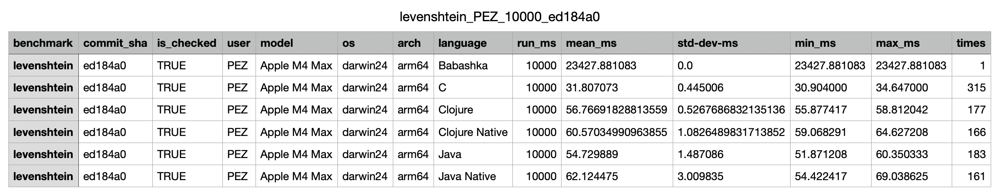

# Languages

Having fun together, learning about programming languages, compilers, interpreters, and toolchains, by way of microbenchmarks.

> [!NOTE]
> We are in the process of replacing our previous benchmark runner with one that relies on in-process measurements, *removing the influence of start/setup times from the results*. Please help in this transitioning by adding the necessary tooling to languages that lack it. See below, under [The Runner](#the-runner).

We're learning together here.

* If you have a suggestion for improvement, want to add a language, a benchmark, fix a bug or typo: Issues and PRs. Which one to use depends. But generally is is first Issue, then PR, where you can use the issue to formulate the problem statement, and PRs to address the problem. Use your judgement and we will succeed.
* Have a question? -> Issue.

## Running the benchmarks

To run benchmarks you need toolchains to run (and often to compile) the programs for the languages you want to benchmark. The scripts are written so that benchmarks are compiled and run for any language for which you have a working toolchain.

To run the steps for all benchmarks, from the project root:

1. Compile the programs that need compiling:

   ```
   $ ./compile.sh
   ```
1. Run, providing your GitHub user handle, e.g.:

   ```
   $ ./run.sh -u PEZ
   ```

   (This is what we refer to as [The Runner](#the-runner))
1. Clean build files:

   ```
   $ ./clean.sh
   ```

You can also do it on a per-benchmark fashion by doing `cd` to the benchmark directory you want to run and invoking the scripts from the parent dir (`../compile.sh`,  and so on).

## The Runner

The general strategy for the runner to benchmark only the targeted function is that it is the programs being benchmarked that do the benchmarking in-process. They only measure around the single piece of work that the benchmark is about. So for **fibonacci** only the call to the function calculating `fibonacci(n)` should be measured. For **levenshtein** benchmark a function that collects all pairing distances is measured. This is because we use the sum of the distances for [correctness check](#correctness-check).

Each program (language) will be allowed the same amount of time to complete the benchmark work (as many times as it can).

Because of the above, each language will have to have some minimal utility/tooling for running the function-under-benchmark as many times as a timeout allows, plus reporting the measurements and the result. Here are three implementations, that we can regard as being reference:

* [benchmark.clj](lib/clojure/src/languages/benchmark.clj)
* [benchmark.java](lib/java/languages/Benchmark.java)
* [benchmark.c](lib/c/benchmark.c) (This one may need some scrutiny from C experts before we fully label it as *reference*.)

You'll see that the `benchmark/run` function takes two arguments:

1. `f`: A function (a thunk)
1. `run-ms`: A total time in milliseconds within which the function should be run as many times as possible

To make the overhead of running and measuring as small as possible, the runner takes a delta time for each time it calls `f`. It is when the sum of these deltas, `total-elapsed-time`, is over the `run-ms` time that we stop calling `f`. So, for a `run-ms` of `1000` the total runtime will always be longer than a second. Because we will almost always “overshoot” with the last run, and because the overhead of running and keeping tally, even if tiny, will always be _something_.

> [!IMPORTANT]
> The benchmark utility needs to use a monotonic clock for the measurements. If the target platforms support it, it should use monotonic nanoseconds to be able to measure the run time of quickly executed functions.

The benchmark/run function is responsible to report back the result/answer to the task being benchmarked, as well as some stats, like mean run time, standard deviation, min and max times, and how many runs where completed.

### Running a benchmark

The new run script is named [run.sh](run.sh). Let's say we run it in the **levenstein** directory:

```sh
../run.sh -u PEZ
```

The default run time is `10000` ms. `-u` sets the user name (preferably your GitHub handle). The output was this:

```csv
benchmark,timestamp,commit_sha,is_checked,user,model,ram,os,arch,language,run_ms,mean_ms,std-dev-ms,min_ms,max_ms,runs
levenshtein,2025-01-18T23:32:41Z,8e63938,true,PEZ,Apple M4 Max,64GB,darwin24,arm64,Babashka,10000,23376.012916,0.0,23376.012916,23376.012916,1
levenshtein,2025-01-18T23:32:41Z,8e63938,true,PEZ,Apple M4 Max,64GB,darwin24,arm64,C,10000,31.874277,0.448673,31.286000,35.599000,314
levenshtein,2025-01-18T23:32:41Z,8e63938,true,PEZ,Apple M4 Max,64GB,darwin24,arm64,Clojure,10000,57.27048066857143,2.210445845051782,55.554958,75.566792,175
levenshtein,2025-01-18T23:32:41Z,8e63938,true,PEZ,Apple M4 Max,64GB,darwin24,arm64,Clojure Native,10000,59.95592388622754,0.8493245545620596,58.963833,62.897834,167
levenshtein,2025-01-18T23:32:41Z,8e63938,true,PEZ,Apple M4 Max,64GB,darwin24,arm64,Java,10000,55.194704,1.624322,52.463125,63.390833,182
levenshtein,2025-01-18T23:32:41Z,8e63938,true,PEZ,Apple M4 Max,64GB,darwin24,arm64,Java Native,10000,60.704966,6.579482,51.807750,96.343541,165
```

It's a CSV file you can open in something Excel-ish, or consume with your favorite programming language.



As you can see, it has some meta data about the run, in addition to the benchmark results. **Clojure** ran the benchmark 175 times, with a mean time of **57.3 ms**. Which shows the point with the new runner, considering that Clojure takes **300 ms** (on the same machine) to start.

See [run.sh](run.sh) for some more command line options it accepts. Let's note one of them: `-l` which takes a string of comma separated language names, and only those languages will be run. Good for when contributing a new language or updates to a language. E.g:

```
~/Projects/languages/levenshtein ❯ ../run.sh -u PEZ -l Clojure
Running levenshtein benchmark...
Results will be written to: /tmp/languages-benchmark/levenshtein_PEZ_10000_5bb1995_only_langs.csv

Checking levenshtein Clojure
Check passed
Benchmarking levenshtein Clojure
java -cp clojure/classes:src:/Users/pez/.m2/repository/org/clojure/clojure/1.12.0/clojure-1.12.0.jar:/Users/pez/.m2/repository/org/clojure/core.specs.alpha/0.4.74/core.specs.alpha-0.4.74.jar:/Users/pez/.m2/repository/org/clojure/spec.alpha/0.5.238/spec.alpha-0.5.238.jar run 10000 levenshtein-words.txt
levenshtein,5bb1995,true,PEZ,Apple M4 Max,darwin24,arm64,Clojure,10000,56.84122918181818,0.8759056030546785,55.214541,59.573,176

Done running levenshtein benchmark
Results were written to: /tmp/languages-benchmark/levenshtein_PEZ_10000_5bb1995_only_langs.csv
```

### Compiling a benchmark

This works as before, but since the new programs are named `run` instead of `code`, we need a new script. Meet: [compile.sh](compile.sh)

```sh
../compile.sh
```

### Adding a language

To add (or port) a language for a benchmark to the new runner you'll need to add:

1. A benchmarking utility in `lib/<language>`
1. Code in `<benchmark>/<language>/run.<language-extension>` (plus whatever extra project files)
   - If you are porting from the legacy runner, copy the corresponding `code.<language-extension>` and start from there. See about [benchmark changes](#changes-to-the-benchmarks-compared-to-legacy-runner) below.
   - To make compare and review of the benched function easier, please split it out in its own module, e.g. [fibonacci/zig/fibonacci.zig](fibonacci/zig/fibonacci.zig). The Zig contributions are currently the best examples to follow here.
1. A compile entry in `languages.sh` (copy from `compile-legacy.sh` if you are porting)
1. An run entry in `languages.sh` (copy from `run-legacy.sh` if you are porting)
1. Maybe some code in `clean.sh` (All temporary/build files should be cleaned.)
1. Maybe some entries in `.gitignore` (All build files, and temporary toolchain files should be added here.)

The `main` function of the program provided should take three arguments:

1. The run time in milliseconds
1. The warmup time in milliseconds
1. The input to the function
   - There is only one input argument, unlike before. How this input argument should be interpreted depends on the benchmark. For **levenshtein** it is a file path, to the file containing the words to use for the test.

As noted before the program should run the function-under-benchmark as many times as it can, following the example of the reference implementations mentioned above. The program is allowed to run warmup runs before the actual benchmark run. E.g. so that a JIT compiler will have had some chance to optimize. It should then pass the warmup time to its benchmark runner.

The program should output a csv row with:

```csv
mean_ms,std-dev-ms,min_ms,max_ms,times,result
```

Before a PR with a new or ported language contribution will be merged, you should provide output (text) from a benchmark run. To facilitate this both `compile.sh` and `run.sh` takes a `-l <languages>` argument, where `<languages>` is a comma-seprated list of language names. E.g.:

```sh
$ ../compile.sh -l 'C,Clojure'
$ ../run.sh -u PEZ -l 'C,Clojure'
```

Please provide output from all benchmark contributions you have added/touched.

### Changes to the benchmarks compared to legacy runner

When adapting a language implementation of some benchmark, consider these differences

* **fibonacci**:
  * The program should return the result of `fib(n)`. This is to keep the benchmark focused on one thing.
  * Early exit for `n < 2` are now allowed, again to keep the benchmark focused.
  * The input is now `37`, to allow slower languages to complete more runs.
* **loops**: The inner loop is now 10k, again to allow slower languages to complete more runs.
* **levenshtein**:
  1. Smaller input (slower languages...)
  1. The input is provided via a file (pointed at by the input argument)
  1. We only calculate each word pairing distance once (A is as far from B as B is from A)
  1. There is a single result, the sum of the distances.
* **hello-world**: No changes.
  * It needs to accept and ignore the two arguments (There is no benchmarking code in there, because it will be benchmarked out-of-process, using **hyperfine**)

Let's look at the `-main` function for the Clojure **levenshtein** contribution:

```clojure
(defn -main [& args]
  (let [run-ms (parse-long (first args))
        warmup-ms (parse-long (second args))
        input-path (nth args 2)
        strings (-> (slurp input-path)
                    (string/split-lines))
        _warmup (benchmark/run #(levenshtein-distances strings) warmup-ms)
        results (benchmark/run #(levenshtein-distances strings) run-ms)]
    (-> results
        (update :result (partial reduce +))
        benchmark/format-results
        println)))
```

The `benchmark/run` function returns a map with the measurements and the result keyed on `:result`. *This result is a sequence of all the distances.* Outside the benchmarked function we sum the distances, and then format the output with this sum. It's done this way to minimize the impact that the benchmarking needs has on the benchmarked work. (See [levenshtein/jvm/run.java](levenshtein/jvm/run.java) or [levenshtein/c/run.c](levenshtein/c/run.c) if the Lisp is tricky to read for you.)

## Available Benchmarks

#### [hello-world](./hello-world/README.md)

#### [loops](./loops/README.md)

#### [fibonacci](./fibonacci/README.md)

#### [levenshtein](./levenshtein/README.md)

## Corresponding visuals

Here's a visualization of a run using the languages ported to the in-process runner as of January 23, 2024

- https://pez.github.io/languages-visualizations/#https://gist.github.com/PEZ/411e2da1af3bbe21c4ad1d626451ec1d
- The https://pez.github.io/languages-visualizations/ page will soon be defaulting to the in-process runs

### Legacy visuals

Several visuals have been published based on the work here.

- https://benjdd.com/languages
- https://benjdd.com/languages2
- https://benjdd.com/languages3

- https://pez.github.io/languages-visualizations/v2025.01.21/
